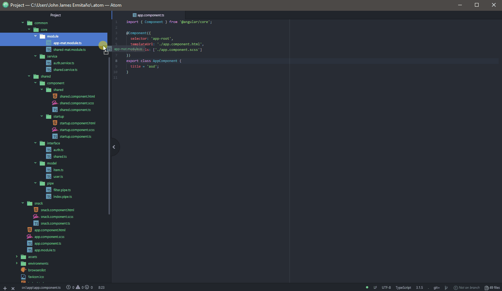
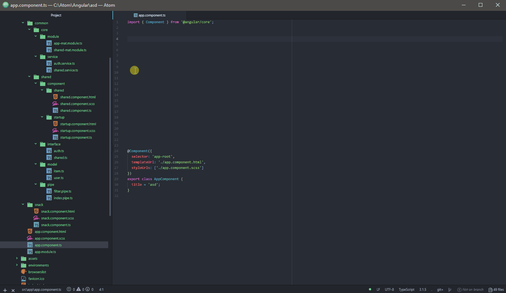

# angular-drag-import package

[Angular](https://atom.io/ "angular.io") auto import in [Atom](https://angular.io/ "atom.io") by drag and dropping [typescript](https://www.typescriptlang.org/ "typescriptlang.org") files from tree-view to your editor pane.

# Features

* Append import path at the end or before the import list.
* Select line (mouse) to import.
  </img>

# Use

Drag and drop Angular service, modules, components, pipes, interfaces and models to import to another typescript file like a boss.
