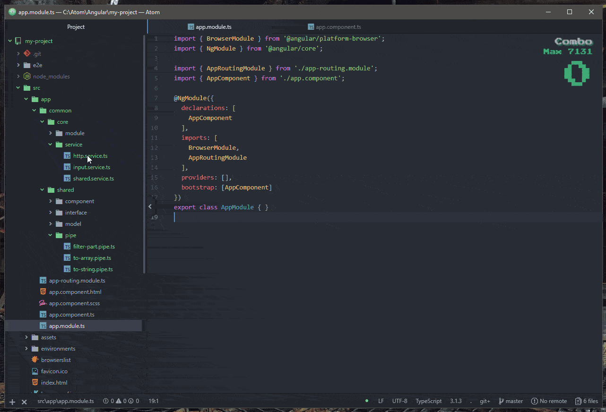

# angular-drag-import package

Angular auto import by drag and dropping typescript files from tree-view to your editor pane.

# Use

Drag and drop your service, modules, components, pipes, interfaces and models to import to another typescript file like a boss.
